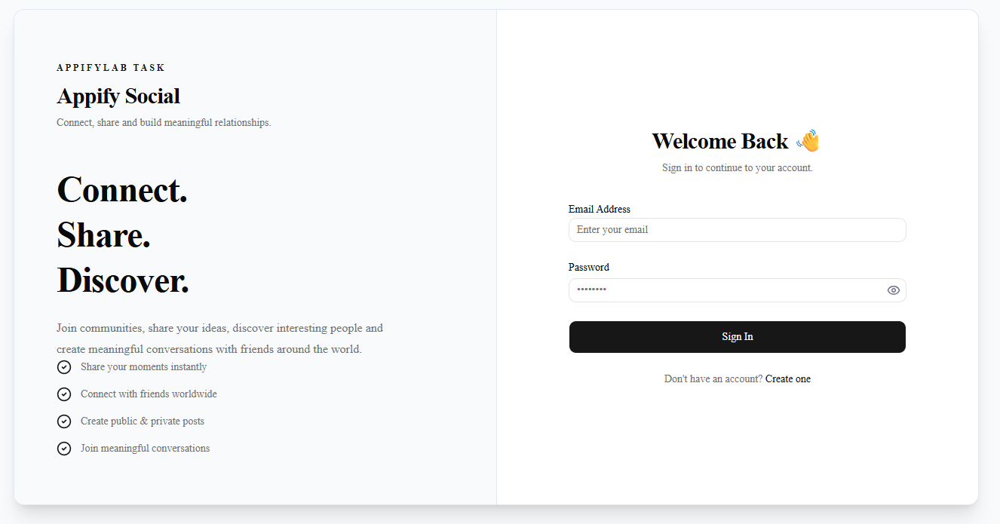
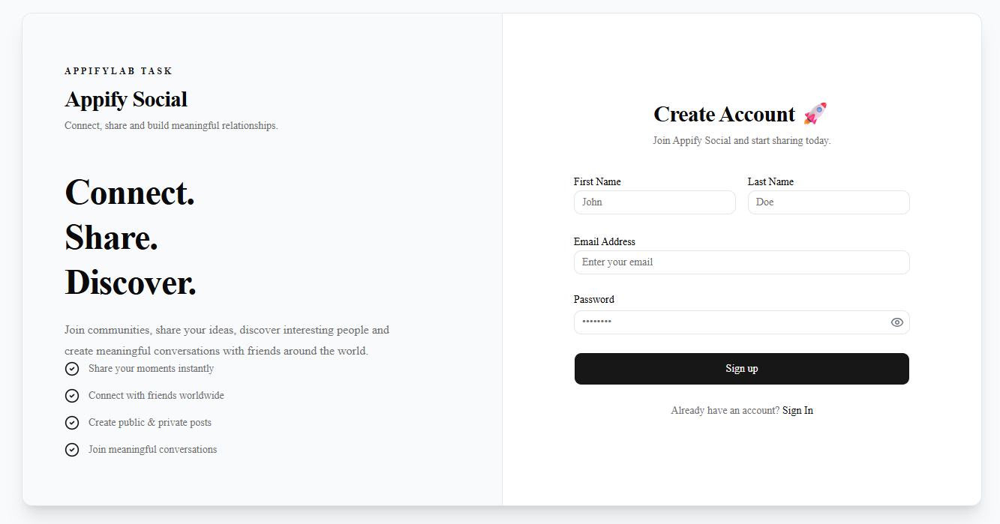
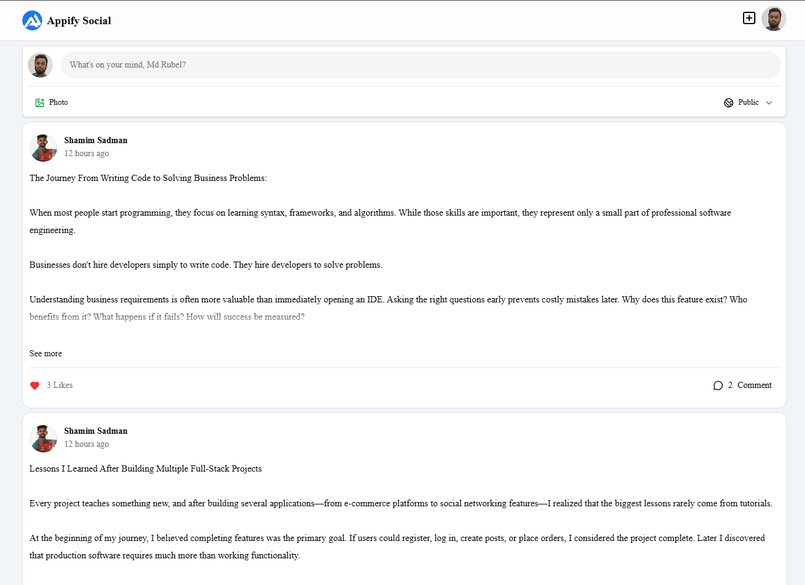
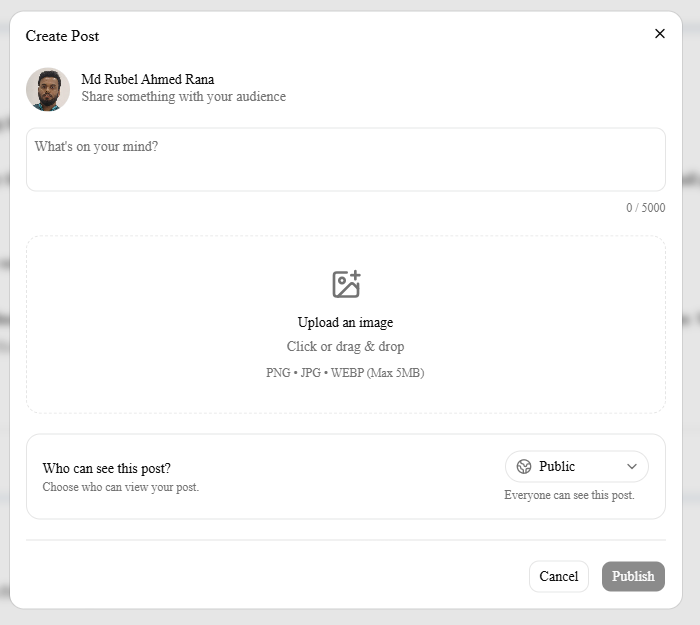
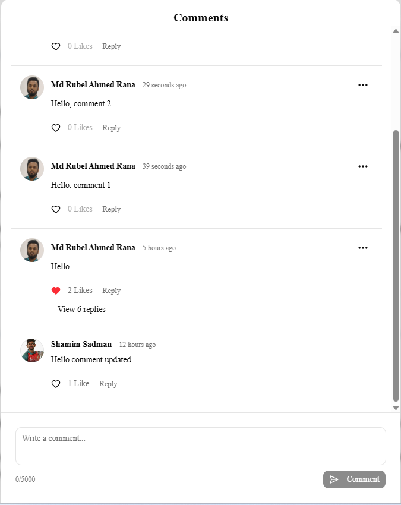
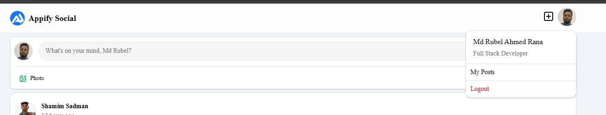
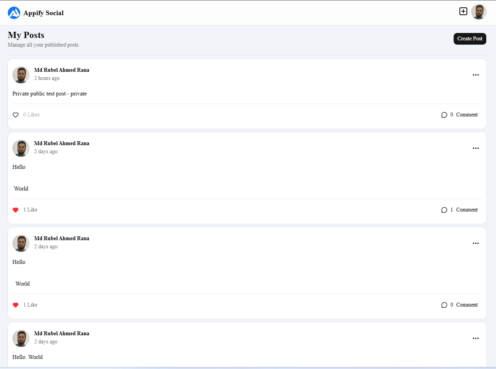

# Appify Social

> A modern full-stack social media platform built with **Next.js**, **Node.js**, **Express.js**, and **MongoDB** as part of the **AppifyLab Full Stack Engineer Selection Task**.

Appify Social is a feature-rich social networking application that enables users to create and interact with posts in a secure and scalable environment. The application supports authentication, post creation with images, likes, comments, replies, and post visibility control (Public/Private), while following modern full-stack development practices and a modular feature-based architecture.

The project was designed with a strong focus on:

- Clean Architecture
- Security
- Scalability
- Performance
- Developer Experience
- User Experience

---

# 🌐 Live Demo

| Resource          | Link                                                                               |
| ----------------- | ---------------------------------------------------------------------------------- |
| Frontend          | https://appify-social.mdrubelahmedrana.com                                         |
| Backend API       | https://api-appify-social.mdrubelahmedrana.com                                     |
| API Documentation | https://documenter.getpostman.com/view/46201161/2sBY4Mv29R                         |
| ERD Diagram       | https://dbdiagram.io/d/Appify-Social-Platform-ERD-Diagram-69e39813a5db712fe585ba8d |
| Video Walkthrough | https://youtube.com/watch?v=[video url will be added after uploading]              |

---

# ✨ Features

## 🔐 Authentication & Authorization

- User Registration
- User Login
- JWT-based Authentication
- HTTP-only Cookie Authentication
- Protected Routes
- Route-level Authorization
- Secure Logout
- Profile Completion

---

## 📝 Posts

- Create text posts
- Upload post image
- Public & Private post visibility
- Update own posts
- Delete own posts
- Toggle post visibility
- Latest posts first
- Infinite scrolling feed

---

## ❤️ Social Interactions

### Post

- Like / Unlike posts
- View users who liked a post

### Comments

- Add comments
- Like / Unlike comments
- View comment likes

### Replies

- Reply to comments
- Reply to Another Reply
- Like / Unlike replies
- View reply likes

---

## 👤 User Features

- View author profile
- Edit profile information
- View own posts
- Profile avatar support

---

## 🚀 User Experience

- Responsive design
- Loading skeletons
- Optimistic UI updates
- Toast notifications
- Form validation
- Error handling
- Empty states
- Image preview before upload

---

## 🛡 Security

- JWT Authentication
- HTTP-only Cookies
- Server-side Validation
- HTML Sanitization
- Protected API Routes
- Ownership-based Authorization
- Rate Limiting
- Secure Image Upload

---

# 🛠 Tech Stack

## Frontend

| Technology           | Purpose                 |
| -------------------- | ----------------------- |
| Next.js (App Router) | React Framework         |
| React                | UI Library              |
| TypeScript           | Type Safety             |
| Tailwind CSS         | Styling                 |
| shadcn/ui            | UI Components           |
| Redux Toolkit        | Global State Management |
| RTK Query            | API State Management    |
| React Hook Form      | Form Handling           |
| Zod                  | Schema Validation       |

---

## Backend

| Technology         | Purpose           |
| ------------------ | ----------------- |
| Node.js            | Runtime           |
| Express.js         | REST API          |
| TypeScript         | Type Safety       |
| MongoDB            | Database          |
| Mongoose           | ODM               |
| JWT                | Authentication    |
| AWS S3             | Image Storage     |
| Multer             | File Upload       |
| Express Rate Limit | API Rate Limiting |
| sanitize-html      | HTML Sanitization |

---

# 🏗 Project Architecture

The project follows a **Modular Feature-Based Architecture**, where each business domain is implemented as an independent module. Instead of organizing the codebase by technical layers (such as controllers, services, or models), both the frontend and backend are structured around application features like **Authentication**, **Posts**, **Comments**, **Replies**, **Likes**, and **Users**.

This architecture improves maintainability, scalability, and code organization by keeping all related logic together.

### Architecture Characteristics

- Modular Feature-Based Structure
- Domain-Oriented Organization
- Separation of Concerns
- Reusable Components
- Scalable Folder Structure
- RESTful API Design
- Centralized Error Handling
- Type-safe Development

---

# 📁 Project Structure

```text
appify-social/
│
├── frontend/
│   ├── src/
│   │   ├── api/
│   │   ├── app/
│   │   ├── components/
│   │   ├── config/
│   │   ├── hooks/
│   │   ├── lib/
│   │   ├── redux/
│   │   ├── types/
│   │   └── proxy.ts
│   │
│   ├── public/
│   └── package.json
│
├── backend/
│   ├── src/
│   │   ├── config/
│   │   ├── constants/
│   │   ├── events/
│   │   ├── helpers/
│   │   ├── interfaces/
│   │   ├── lib/
│   │   ├── middlewares/
│   │   ├── modules/
│   │   ├── routes/
│   │   ├── shared/
│   │   ├── utils/
│   │   ├── app.ts
│   │   └── server.ts
│   │
│   └── package.json
│
└── README.md
```

---

# 🖥 Frontend Architecture

The frontend is built with **Next.js App Router** and organized using a feature-based component architecture. Every major feature of the application has its own dedicated API layer, UI components, and related logic.

```text
src/
│
├── api/
│   ├── auth/
│   ├── comments/
│   ├── likes/
│   ├── posts/
│   └── replies/
│
├── app/
│   ├── (protected)/
│   ├── signin/
│   └── signup/
│
├── components/
│   ├── auth/
│   ├── author-posts/
│   ├── comments/
│   ├── common/
│   ├── create-comment/
│   ├── create-post/
│   ├── errors/
│   ├── feed/
│   ├── likes/
│   ├── post-card/
│   ├── posts/
│   ├── replies/
│   └── ui/
│
├── redux/
├── hooks/
├── config/
├── lib/
└── types/
```

### Frontend Design Decisions

- Feature-oriented folder organization
- Centralized API communication using RTK Query
- Global state management with Redux Toolkit
- Reusable UI components with shadcn/ui
- Type-safe development using TypeScript
- Form handling with React Hook Form and Zod
- Route protection using Next.js middleware

---

# ⚙ Backend Architecture

The backend follows a modular architecture where every business domain owns its routes, controller, service, model, validation, and interfaces.

```text
modules/
│
├── auth/
├── aws/
├── comments/
├── likes/
├── media/
├── posts/
├── replies/
└── users/
```

Example module structure:

```text
posts/
│
├── posts.controller.ts
├── posts.interface.ts
├── posts.model.ts
├── posts.routes.ts
├── posts.service.ts
└── posts.validate.ts
```

### Backend Design Decisions

- Feature-based module organization
- RESTful API architecture
- Business logic separated into services
- Thin controllers
- Schema validation before request processing
- Centralized middleware handling
- Shared utility functions
- Strong TypeScript typing

---

# 🔄 High-Level Request Flow

```text
Client
   │
   ▼
Next.js Frontend
   │
   ▼
RTK Query
   │
   ▼
Express API
   │
   ▼
Authentication Middleware
   │
   ▼
Validation Middleware
   │
   ▼
Route
   │
   ▼
Controller
   │
   ▼
Service
   │
   ▼
MongoDB / AWS S3
   │
   ▼
Response
```

---

# 🎯 Why This Architecture?

This architecture was selected to keep the project clean, scalable, and easy to maintain as new features are added.

### Benefits

- Easier feature development
- Better separation of responsibilities
- Improved code readability
- Independent feature modules
- Reduced coupling between features
- Reusable business logic
- Easier onboarding for new developers
- Better long-term maintainability

As the application grows, new modules (such as Notifications, Messaging, or Friend Requests) can be added with minimal impact on the existing codebase.

---

# 📐 Architectural Principles

- Feature-Based Organization
- Separation of Concerns
- DRY (Don't Repeat Yourself)
- Reusability
- Type Safety
- Single Responsibility Principle
- RESTful API Design

---

# 🗄 Database Design

The application uses **MongoDB** as its primary database and follows a normalized, relationship-oriented schema using **Mongoose**. The data model is organized around the core social media entities, enabling efficient querying, scalability, and maintainability.

---

# 📊 Entity Relationship Diagram (ERD)

> **ERD Diagram:** https://your-erd-diagram-link.com

> Replace the placeholder above with your final ERD diagram before submission.

---

# 📦 Database Collections

The application consists of the following primary collections:

| Collection | Description                                   |
| ---------- | --------------------------------------------- |
| Users      | Stores user accounts and profile information  |
| Posts      | Stores user-created posts                     |
| Comments   | Stores comments on posts                      |
| Replies    | Stores replies to comments                    |
| Likes      | Stores likes for posts, comments, and replies |
| Media      | Stores uploaded media metadata                |

---

# 🔗 Data Relationships

The following diagram illustrates the relationship between the core entities.

```text
User
 │
 ├──────────────┐
 │              │
 ▼              ▼
Posts         Likes
 │
 ├──────────────┐
 │              │
 ▼              ▼
Comments      Likes
 │
 ├──────────────┐
 │              │
 ▼              ▼
Replies       Likes
```

### Relationship Overview

- A user can create multiple posts.
- A post belongs to a single author.
- A post can have multiple comments.
- A comment belongs to one post.
- A comment can have multiple replies.
- A reply belongs to one comment.
- Users can like posts, comments, and replies.
- Uploaded images are managed separately through the media collection.

---

# 🔐 Authentication Flow

The application uses **JWT-based authentication** with **HTTP-only cookies** to provide secure session management.

### Authentication Process

```text
User Login
      │
      ▼
Validate Credentials
      │
      ▼
Generate Access Token
      │
      ▼
Generate Refresh Token
      │
      ▼
Store Tokens in HTTP-only Cookies
      │
      ▼
Authenticated Requests
```

---

# 🔄 Authorization Flow

Every protected request follows the authorization pipeline below.

```text
Incoming Request
        │
        ▼
Authentication Middleware
        │
        ▼
Verify JWT Token
        │
        ▼
Load Current User
        │
        ▼
Ownership Validation
        │
        ▼
Execute Requested Action
```

Authorization ensures that users can only perform operations on resources they own, such as editing or deleting their own posts.

---

# 🍪 Session Management

Authentication state is maintained using secure HTTP-only cookies.

### Benefits

- Access tokens are inaccessible to JavaScript.
- Reduced risk of XSS attacks.
- Secure authentication across requests.
- Automatic session persistence.
- Refresh token support for seamless authentication.

---

# 🛡 Security Design

Security was considered throughout the development process to protect both user data and application resources.

### Authentication Security

- JWT-based authentication
- HTTP-only cookies
- Protected routes
- Route-level authorization
- Secure logout mechanism

---

### Input Validation

- Request validation using Zod
- Server-side validation
- Type-safe request handling
- Meaningful validation errors

---

### Content Security

- HTML sanitization before storing content
- Secure image upload validation
- File type validation
- File size restrictions

---

### Authorization

- Ownership-based access control
- Private post protection
- Author-only update and delete permissions
- Protected API endpoints

---

### API Protection

- Rate limiting
- Centralized error handling
- Secure middleware pipeline
- Environment variable configuration

---

# ⚡ Scalability Considerations

The project structure and backend architecture were designed with future scalability in mind.

Current scalability considerations include:

- Modular feature-based architecture
- Independent business modules
- RESTful API design
- Separation of business logic
- Reusable shared utilities
- Type-safe codebase
- MongoDB document modeling
- AWS S3 for media storage

These design decisions make it straightforward to introduce additional features such as Notifications, Messaging, Friend Requests, or Groups without major architectural changes.

---

# 🚀 Core Functionalities

The application provides a complete social media experience where authenticated users can create content, interact with other users, and manage their own posts securely.

---

# 👤 User Management

## Authentication

- User Registration
- User Login
- Secure Logout
- Protected Routes
- JWT Authentication
- HTTP-only Cookie Authentication

---

## Profile

- Complete profile information
- Update profile
- Upload profile avatar
- View author profile
- View personal posts

---

# 📝 Post Management

Users can create and manage posts with support for text and images.

### Features

- Create new posts
- Upload post images
- Public / Private visibility
- Edit own posts
- Delete own posts
- Toggle post visibility
- View latest posts first

---

# 💬 Comment System

Every post supports threaded discussions.

### Features

- Add comments
- Edit own comments
- Delete own comments
- Like / Unlike comments
- View comment likes

---

# 💬 Reply System

Users can reply directly to comments.

### Features

- Reply to comments
- Reply to Another Reply
- Like / Unlike replies
- View reply likes
- Edit own replies
- Delete own replies

---

# ❤️ Like System

The application supports independent like systems for multiple resources.

Users can:

- Like posts
- Unlike posts
- Like comments
- Unlike comments
- Like replies
- Unlike replies

Users can also view the list of users who reacted to each resource.

---

# 🌍 Feed System

The feed aggregates posts from users while respecting post visibility.

### Feed Behavior

- Newest posts appear first.
- Public posts are visible to everyone.
- Private posts are only visible to their author.
- Infinite scrolling for continuous browsing.
- Optimized server-side pagination with cursor.

---

# 🔄 Post Visibility

Each post supports two visibility levels.

| Visibility | Description                         |
| ---------- | ----------------------------------- |
| Public     | Visible to every authenticated user |
| Private    | Visible only to the author          |

Authors can change the visibility of their posts at any time.

---

# 📂 Image Upload

Images are uploaded and stored separately from the application server.

Upload workflow:

```text
Select Image
      │
      ▼
Frontend Validation
      │
      ▼
Upload Request
      │
      ▼
Backend Validation
      │
      ▼
AWS S3 Storage
      │
      ▼
Media Metadata Saved
      │
      ▼
Refer to Target Collection
```

---

# 🌐 REST API Overview

The backend exposes a RESTful API organized by business domains.

## Authentication

```text
/auth
```

Responsible for:

- Registration
- Login
- Logout
- Profile Information
- Profile Update

---

## Posts

```text
/posts
```

Responsible for:

- Create
- Read
- Update
- Delete
- Visibility Toggle
- Feed Retrieval

---

## Comments

```text
/comments
```

Responsible for:

- Create
- Delete
- Retrieve
- Like Management

---

## Replies

```text
/replies
```

Responsible for:

- Reply Creation
- Delete
- Like Management

---

## Likes

```text
/likes
```

Responsible for:

- Like
- Unlike
- Reaction Lists

---

# 📱 Frontend Routing

The application is built using the Next.js App Router.

### Public Routes

```text
/
├── signin
└── signup
```

---

### Protected Routes

```text
/
├── /feed
├── /my-posts
└── /profile/posts
```

---

# ⚙ State Management

The frontend uses **Redux Toolkit** together with **RTK Query**.

### Redux

Responsible for:

- Authentication State
- User State
- Global UI State

---

### RTK Query

Responsible for:

- API Requests
- Request Caching
- Cache Invalidation
- Background Refetching
- Loading States
- Error Handling

---

# 🎯 Assignment Coverage

The project fully implements the required functionalities from the AppifyLab Full Stack Engineer Selection Task.

| Requirement            | Status |
| ---------------------- | ------ |
| Authentication         | ✅     |
| Protected Feed         | ✅     |
| Create Posts           | ✅     |
| Image Upload           | ✅     |
| Latest Posts First     | ✅     |
| Like / Unlike Posts    | ✅     |
| Comments               | ✅     |
| Replies                | ✅     |
| Like / Unlike Comments | ✅     |
| Like / Unlike Replies  | ✅     |
| View Likes             | ✅     |
| Public & Private Posts | ✅     |

---

# ⭐ Additional Features

Beyond the assignment requirements, the project also includes:

- Author Profile
- Profile Editing
- My Posts
- Infinite Scrolling Feed
- Loading Skeletons
- Optimistic UI Updates
- Toast Notifications
- Reusable Component Architecture
- Modular Backend Architecture

---

# ⚡ Performance Optimizations

The application includes several optimizations to improve responsiveness, scalability, and overall user experience.

## Frontend

- RTK Query request caching
- Automatic cache invalidation
- Optimistic UI updates
- Lazy loading where appropriate
- Infinite scrolling
- Loading skeletons
- Component reusability
- Type-safe API communication

---

## Backend

- Modular feature-based architecture
- Centralized middleware pipeline
- Optimized MongoDB queries
- Request validation before processing
- Efficient document relationships
- RESTful API design
- Image storage using AWS S3

---

## Scalability

The project was designed with future scalability in mind.

Current architectural decisions support:

- Independent business modules
- Feature isolation
- Reusable shared utilities
- Easily extensible API
- Cloud-based media storage
- Separation of business logic

This architecture makes it straightforward to introduce future modules such as:

- Notifications
- Friend Requests
- Direct Messaging
- User Following
- Saved Posts
- Groups

---

# 🔒 Security Best Practices

Security was considered throughout the development process.

## Authentication

- JWT Authentication
- HTTP-only Cookies
- Protected Routes
- Route Authorization
- Secure Logout

---

## Authorization

- Ownership validation
- Author-only resource modification
- Private post protection
- Protected API endpoints

---

## Validation

- Client-side validation
- Server-side validation
- Zod schema validation
- Request sanitization

---

## Content Protection

- HTML sanitization
- File type validation
- Image size validation
- Secure file uploads

---

## API Security

- Rate Limiting
- Centralized Error Handling
- Environment Variables
- Secure Middleware Pipeline

---

# 🧪 Validation & Error Handling

The application validates requests on both the client and server to ensure data integrity and provide meaningful feedback.

## Validation Strategy

### Client-side

- React Hook Form
- Zod
- Instant validation feedback

### Server-side

- Schema validation
- Business rule validation
- Authorization checks
- Resource ownership validation

---

## Error Handling

The application provides consistent error handling across both frontend and backend.

Examples include:

- Invalid credentials
- Unauthorized access
- Validation failures
- Missing resources
- Unexpected server errors
- File upload failures

---

# 🚀 Getting Started

## Prerequisites

Before running the project locally, ensure the following tools are installed:

- Node.js (Latest LTS recommended)
- npm
- MongoDB
- Git

---

## Clone Repository

```bash
git clone https://github.com/Md-Rubel-Ahmed-Rana/appify-social.git
```

---

## Install Dependencies

### Frontend

```bash
cd frontend
npm install
```

### Backend

```bash
cd backend
npm install
```

---

# 🌍 Environment Variables

Create a `.env` file inside both the frontend and backend directories.

## Frontend

```env
NEXT_PUBLIC_APP_URL=
NEXT_PUBLIC_BASE_API=
ACCESS_TOKEN_COOKIE_NAME=
REFRESH_TOKEN_COOKIE_NAME=
```

---

## Backend

```env
NODE_ENV=
PORT=
APP_NAME=

MONGODB_URL=

CORS_ORIGINS=http://localhost:3000, http://localhost:3001, http://localhost:3002

JWT_TOKEN_SECRET=
ACCESS_TOKEN_EXPIRES_IN=
REFRESH_TOKEN_EXPIRES_IN=
ACCESS_TOKEN_COOKIE_NAME=
REFRESH_TOKEN_COOKIE_NAME=

AWS_ACCESS_KEY_ID=
AWS_SECRET_ACCESS_KEY=
AWS_DEFAULT_REGION=
AWS_BUCKET_NAME=
AWS_FILE_LOAD_BASE_URL=

REDIS_PASSWORD=
REDIS_HOST=
REDIS_PORT=
```

---

# ▶ Running the Application

## Start Backend

```bash
cd backend
npm run dev
```

---

## Start Frontend

```bash
cd frontend
npm run dev
```

---

Once both servers are running, open:

```
http://localhost:3000
```

---

# 📦 Production Build

## Frontend

```bash
npm run build
npm start
```

---

## Backend

```bash
npm run build
npm run start
```

---

# 🚀 Deployment

| Service       | Platform                          |
| ------------- | --------------------------------- |
| Frontend      | Vercel _(Replace as your prefer)_ |
| Backend       | Render _(Replace as your prefer)_ |
| Database      | MongoDB Atlas                     |
| Media Storage | AWS S3                            |

---

# 📸 Screenshots

Add screenshots demonstrating the following pages:

## Signin



---

## Signup



---

## Feed



---

## Create Post



---

## Comments



---

## Replies


---

## User Profile



---

## My Posts



---

# 🎥 Video Walkthrough

A complete walkthrough of the project can be found here:


The walkthrough demonstrates:

- Project Overview
- Authentication
- Feed
- CRUD Operations
- Comments & Replies
- Likes
- Public & Private Posts
- Folder Structure
- API Overview
- Deployment

---

# 🔮 Future Improvements

Possible future enhancements include:

- Friend Requests
- User Following
- Direct Messaging
- Notifications
- Search Functionality
- Saved Posts
- Hashtags
- User Mentions
- Post Sharing
- Dark Mode
- Email Verification
- Password Reset
- Admin Dashboard

---

# 🤝 Contributing

Contributions are welcome.

If you would like to improve the project:

1. Fork the repository.
2. Create a feature branch.
3. Commit your changes.
4. Push the branch.
5. Open a Pull Request.

---

# 👨‍💻 Author

**Md. Rubel Ahmed Rana**

Full Stack Developer

GitHub:
https://github.com/Md-Rubel-Ahmed-Rana

LinkedIn:
https://www.linkedin.com/in/md-rubel-ahmed-rana

Portfolio:
https://mdrubelahmedrana.com

Email:
mdrubelahmedrana521@gmail.com

---

# 🙏 Acknowledgements

This project was developed as part of the **AppifyLab Full Stack Engineer Selection Task**.

Special thanks to the AppifyLab team for providing an engaging full-stack engineering assignment that encouraged thoughtful system design, secure development practices, and clean software architecture.

---

# 📄 License

This project is intended for educational and evaluation purposes as part of the AppifyLab Full Stack Engineer Selection Task.

Unauthorized commercial use is not permitted without permission from the author.
